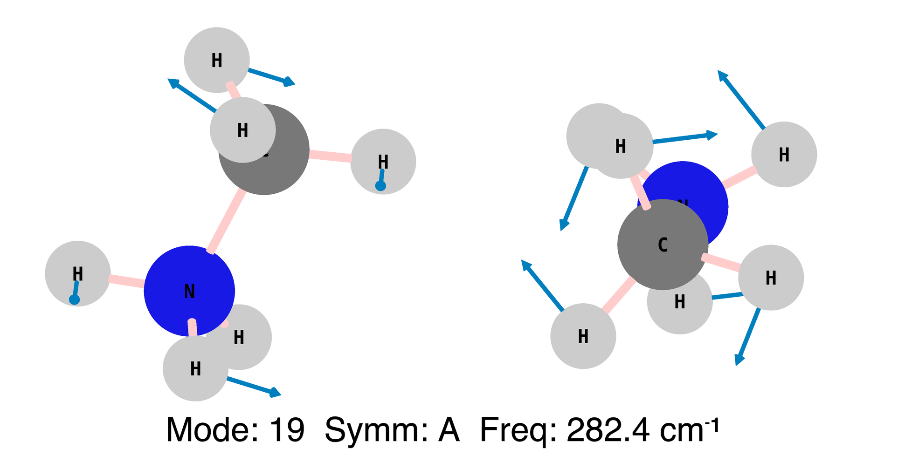

These images, and the associated YouTube video (https://www.youtube.com/watch?v=kOLdmPmTTkk) 
were rendered with Gaussview, and then manipulated with the shellscripts you will find here to generate annotated 
versions of the figures with Imagemagick. 

Rendering with the internal Gaussview 'vibrations' tool was made with 
'lights turned off' to make the atoms pleasantly diffuse, and with custom colours.
The two different views were rendered separately, flicking between them 
(the side view is a specific 90 + 60 degrees set of rotations that I read somewhere was optimal for perspective). 
This was quite labourious, as each mode + view had to individual selected + 
a unique filename given, then ignored for the few minutes while it rendered. 
Poor man's anit-aliasing was achieved by rendering at 2x the final resolution, and then downsampling in post production. 

The resulting PNGs were then manhandled with various BASH shell scripts, 
merged together with the Imagemagick Convert tools. 
These shell scripts are included here.
